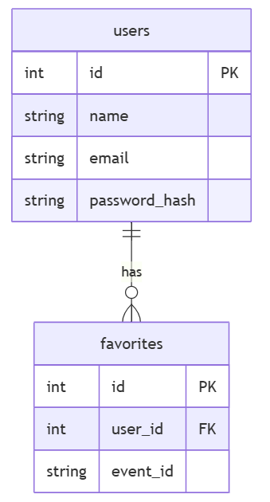
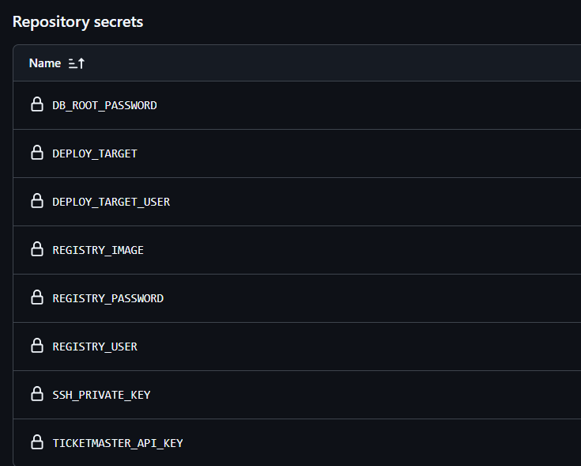
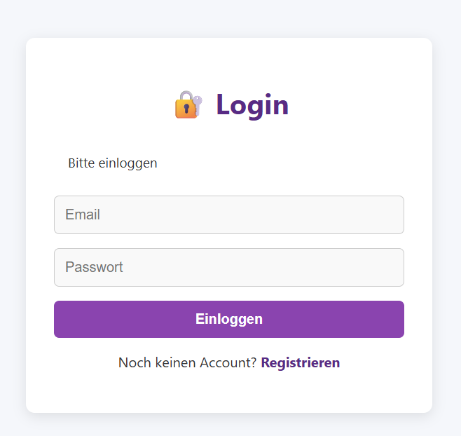
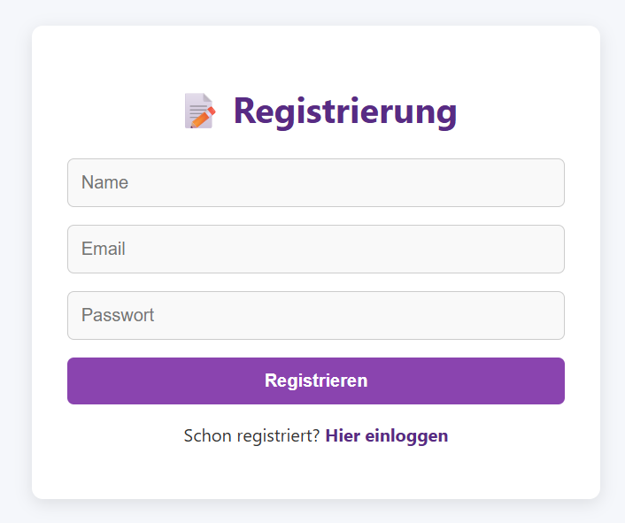
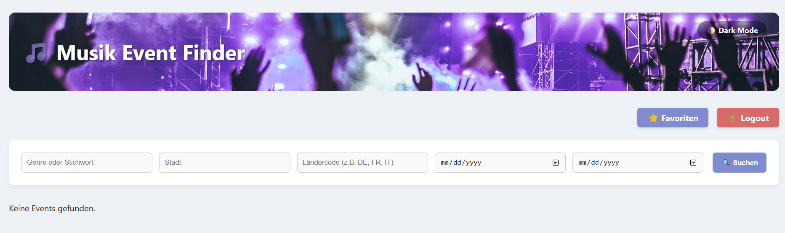
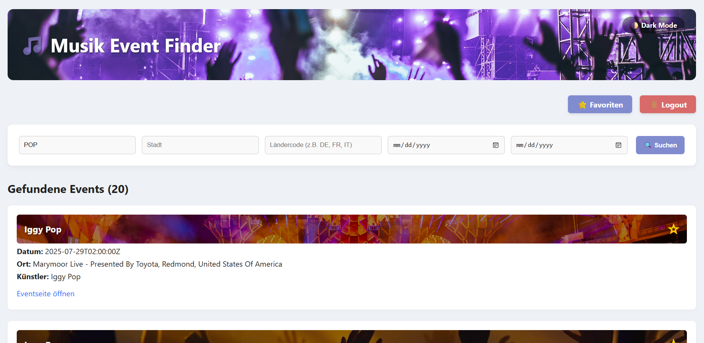
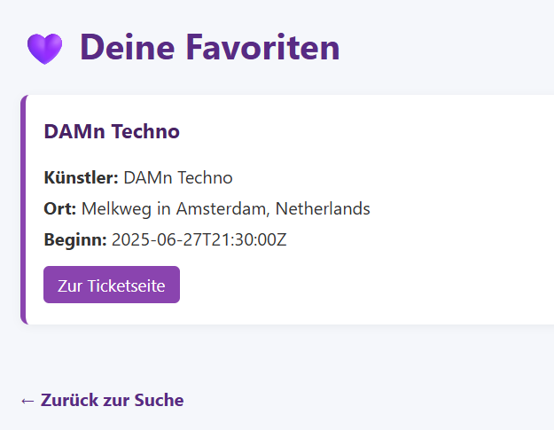
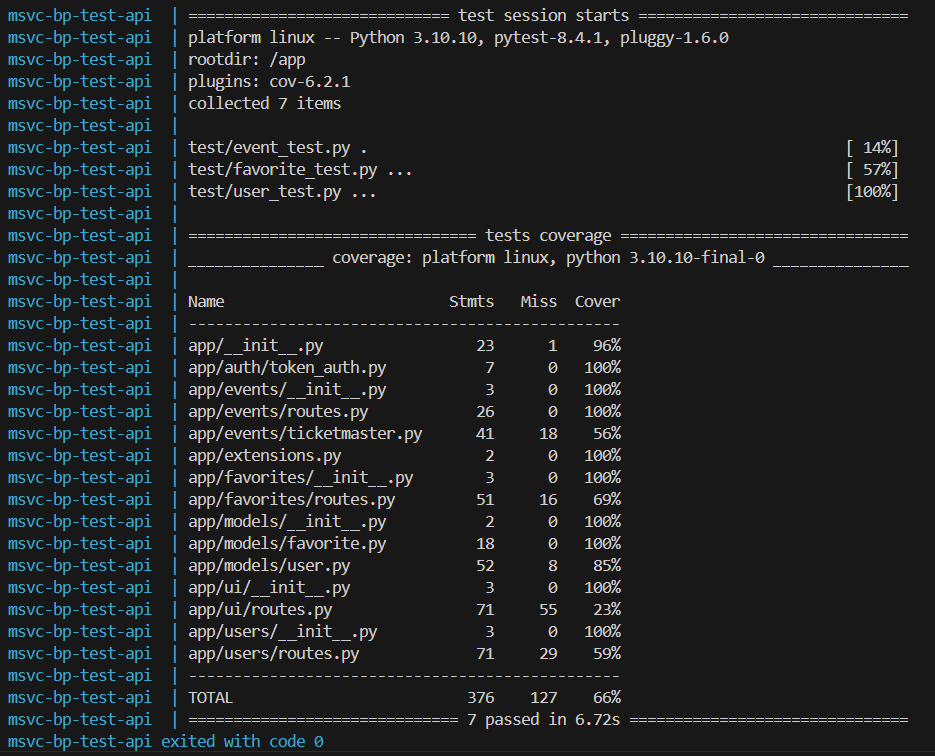
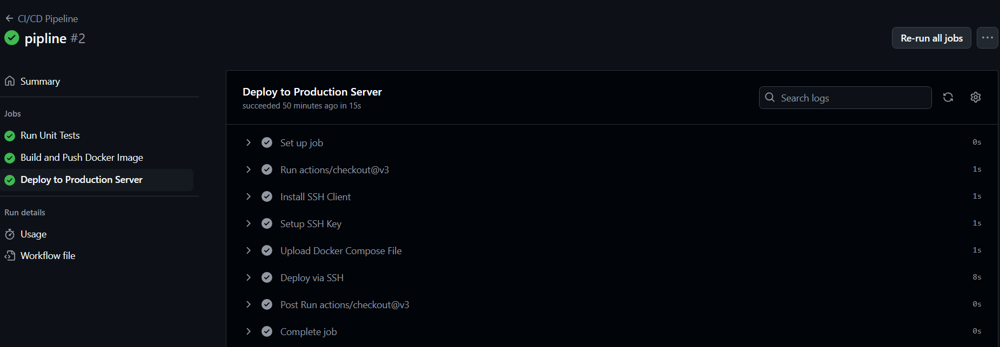
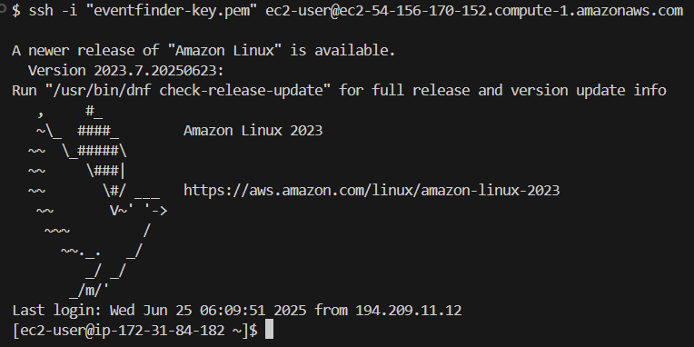

# Teil 3 Realisieren

Kommen wir zur Umsetzung des Projektes. In diesem Teil wird genau beschrieben, wie alles realisiert wurde und wie ich vorgegangen bin. Es wird getestet und geprüft, sodass ersichtlich ist, ob alles funktioniert wie es soll. Falls Probleme aufgetaucht sind, werden diese ebenfalls beschrieben, inklusive Lösungsweg.

- [Teil 3 Realisieren](#teil-3-realisieren)
- [Realisieren](#realisieren)
  - [So funktionierts](#so-funktionierts)
    - [Überblick](#überblick)
    - [Komponenten im Detail](#komponenten-im-detail)
      - [Zusammenspiel der Komponenten](#zusammenspiel-der-komponenten)
  - [Datenbank](#datenbank)
  - [Externe Ticketmaster API](#externe-ticketmaster-api)
  - [Github Secrets](#github-secrets)
  - [Entwicklung](#entwicklung)
    - [Features des Eventfinders](#features-des-eventfinders)
    - [REST-API Endpoints](#rest-api-endpoints)
    - [Docker-Setup](#docker-setup)
    - [Anbindung an externe API](#anbindung-an-externe-api)
    - [Filterfunktionen](#filterfunktionen)
    - [Bereitstellung über CI/CD-Pipeline (AWS EC2)](#bereitstellung-über-cicd-pipeline-aws-ec2)
    - [Codebeispiele](#codebeispiele)
  - [Aufgetretene Probleme](#aufgetretene-probleme)
    - [Favorites hinzufügen](#favorites-hinzufügen)
    - [Migration in die Produktivumgebung](#migration-in-die-produktivumgebung)
  - [Fallbacksolution](#fallbacksolution)
- [Kontrollieren](#kontrollieren)
  - [Testing](#testing)
    - [Testkonzept](#testkonzept)
    - [Testdurchführung](#testdurchführung)
      - [Umgebung:](#umgebung)

# Realisieren

Nun wird die Realisierung beschrieben. Die Umsetzung der Arbeit wird gezeigt inklusive Bilder der Produktiven Umgebung.

## So funktionierts

### Überblick

Der Microservice basiert auf Flask (Python) und ist in einem Docker-Container verpackt. Er verwendet MySQL als Datenbank und SQLAlchemy als ORM (Object-Relational Mapper). Die Anwendung wird über eine CI/CD-Pipeline automatisiert in die Cloud (AWS) deployed und ist dort über eine Elastic IP erreichbar.

### Komponenten im Detail

1. Backend (Flask + Python) Implementiert eine REST-API zur:
- Benutzerregistrierung, Login und Logout (inkl. Token-basiertem Authentifizierungssystem).
- Abfrage und Anzeige von Musik-Events über eine externe API.
- Favorisierung von Events durch eingeloggte Benutzer (CRUD auf Favoriten).
- Nutzt SQLAlchemy für den Datenbankzugriff und -mapping.

2. Datenbank (MySQL) Speichert:
- Benutzerinformationen.
- Favorisierte Events der Benutzer.
- Läuft auf einem separaten Container.

3. Docker
- Die Anwendung wird containerisiert, um eine einheitliche und portable Laufzeitumgebung zu gewährleisten.
- Besteht aus einem Dockerfile und einer docker-compose.yml, um Backend und Datenbank zu verknüpfen.

4. Externe Musik-Event-API
- Der Microservice ruft auf Anfrage Eventdaten von der externen API (Ticketmaster API) ab.
- Diese Daten werden im Backend verarbeitet und dem Frontend bzw. Benutzer zur Verfügung gestellt.

5. CI/CD-Pipeline
- Wird über GitHub Actions realisiert.

Automatischer Ablauf:
- Code Push ins Repository.
- Pipeline baut das Docker-Image.
- Image wird auf eine AWS EC2 Instanz deployed.
- Services werden neu gestartet.

6. Cloud Deployment (AWS EC2 + Elastic IP)
- Eine EC2-Instanz dient als Host für die laufenden Container.
- Die Anwendung wird dort über Docker ausgeführt.
- Eine Elastic IP (statische IP-Adresse) macht den Service dauerhaft über das Internet erreichbar.
 
#### Zusammenspiel der Komponenten

- Der Benutzer greift über den Browser auf die Elastic IP zu.
- Flask empfängt die HTTP-Anfrage und verarbeitet sie.
- Bei Event-Abfragen wird die externe API kontaktiert.
- Bei geschützten Endpunkten wird der Authentifizierungs-Token überprüft.
- Daten werden ggf. aus der MySQL-Datenbank gelesen oder dorthin geschrieben.
- Die CI/CD-Pipeline sorgt dafür, dass nach jedem Push automatisch die aktuellste Version in der Cloud läuft.

## Datenbank

Das Datenbankmodell besteht aus zwei Tabellen: users und favorites. Jeder Benutzer kann beliebig viele Events über die event_id als Favoriten speichern, wobei die Event-Daten über die externe Ticketmaster-API verwaltet und abgerufen werden.



## Externe Ticketmaster API

Die Ticketmaster API habe ich auf folgender Site bezogen: (https://developer-acct.ticketmaster.com/)

Bevor ich diese in mein Service eingebunden habe, habe ich sie getestet. Das Test Skript liegt hier: [Skripts](../Scripts)

## Github Secrets

In diesem Projekt werden GitHub Secrets verwendet, um sensible Informationen sicher innerhalb der CI/CD-Pipeline bereitzustellen. Sie ermöglichen es, automatisierte Prozesse wie das Bauen und Deployen der Anwendung durchzuführen, ohne Zugangsdaten im Quellcode zu speichern.

Folgende Secrets werden in der Pipline benötigt:

- DEPLOY_TARGET - die IP-Adresse oder der DNS-Name des Ziel-Servers
- DEPLOY_TARGET_USER - der user, mit dem wir uns auf dem target server einloggen
- SSH_PRIVATE_KEY - der private SSH-Key des Servers (auf AWS EC2 normalerweise während der Erstellung generiert)
- DB_ROOT_PASSWORD - das Root Passwort der MySQL-Datenbank
- TICKETMASTER_API_KEY - Der API Key, welcher von der Externen Ticketmaster API zur Verfügung gestellt wird
- REGISTRY_USER - der Benutzername für die Container Registry (z. B. GitHub oder Docker Hub)
- REGISTRY_PASSWORD - das Passwort oder der Personal Access Token für die Container Registry
- REGISTRY_IMAGE - der vollständige Name des Docker-Images inkl. Registry und Namespace

Hier sind all meine Secrets im Github:



## Entwicklung

Dies ist der Pfad um auf den Musik Event finder zu gelangen: http://54.156.170.152/ (Nur erreichbar wenn das AWS Learner LAB aktiv ist)

Wie folgt sehen die verchiedenen Seiten aus:

Login Seite:



Registrierungs Seite:



Such Seite:



Abfrage Beispiel Event:



Favoriten Seite:




### Features des Eventfinders

Im Microservice wurden zentrale Funktionen wie Benutzerregistrierung und Login mit sicherer Passwortspeicherung umgesetzt. Nutzer können gezielt nach Events suchen, diese als Favoriten markieren und erhalten zu jedem Event einen Direktlink zum Ticketkauf. Die Events selbst werden dynamisch über die Ticketmaster-API bezogen.

### REST-API Endpoints

Der Microservice bietet mehrere REST-Endpoints zur Interaktion mit Nutzern und Events. Es wurden u. a. Routen für Registrierung, Login, Event-Suche, Favoritenverwaltung und API-Datenbereitstellung implementiert. Die Schnittstellen sind klar strukturiert und REST-konform.

###  Docker-Setup

Für eine einfache Bereitstellung wurde ein Docker-Setup erstellt. Dieses umfasst das Flask-Backend sowie alle notwendigen Abhängigkeiten, sodass der Service containerisiert und unabhängig vom Host-System betrieben werden kann.

### Anbindung an externe API

Die Event-Daten stammen aus der offiziellen Ticketmaster-API. Die API wurde über HTTP-Requests angebunden, die Suchparameter dynamisch angepasst, und die Ergebnisse anschließend im Frontend verwendet.

### Filterfunktionen

Nutzer können Events anhand verschiedener Kriterien filtern. Implementiert wurden Filter für Genre, Stadt, Land sowie für ein frei wählbares Datumsintervall ("von–bis"). Dadurch wird eine gezielte und flexible Event-Suche ermöglicht.

### Bereitstellung über CI/CD-Pipeline (AWS EC2)

Der Microservice wird automatisiert über eine CI/CD-Pipeline auf einer AWS EC2-Instanz bereitgestellt. Nach jedem Push ins Repository erfolgt ein automatischer Build und Deployment-Prozess, sodass neue Änderungen ohne manuellen Eingriff live geschaltet werden können. Dies sorgt für eine kontinuierliche, zuverlässige Auslieferung der Anwendung.

### Codebeispiele

Der gesamte Code, sowie die vollständige Projektstruktur sind im öffentlich verlinkten Git-Repository verfügbar. Dadurch lässt sich der Aufbau des Microservices nachvollziehen und erweitern.

Mein ganzer Code: [Produktionsumgebung](https://github.com/lauradubach/Produktionsumgebung.git)

## Aufgetretene Probleme

Während des programmierens, gab es einige Hürden. Hier werden die grobsten Fehler kurz erläutert und der Lösungsweg beschrieben.

### Favorites hinzufügen

Als ich die Favoriten funktion hinzufügen wollte hatte ich einige Probleme und musste Troubleshooten. Hier sind einige Herausforderungen, die ich hatte:

Im ui/routes.py (im login und register) musste ich folgendes hinzufügen:

`['user_id'] = data['user_id']`

Im users/routes.py musste dies hinzugefügt werden:

```
return {
        'token': token,
        'duration': 600,
        'user_id': user.id
    }
```

Im models/user.py musste `user_id = Integer()` im TokenOut hinzugefügt werden, da die User ID im Json File nicht übergeben wurde.

Damit die bestehende Suche- und der Stern angeklickt bleibt, wenn man einen refresh der Seite macht, habe ich im html dies hinzugefügt:

`<input type="hidden" name="next" value="{{ request.url }}">`

Auch im favorites/routes musste dies entsprechend ergänzt werden.

Ich musste Javascript und CSS integrieren, da beim Klick auf einen Stern, die Füllung sich nicht verändert hatte. Das Skript macht nichts anderes als: Den Klick abzufangen, den Server anzufragen (mit fetch) und den Stern einfärben (CSS-Klasse setzen)

Dies ist das Skript:

```java
<script>
    function toggleDarkMode() {
        document.body.classList.toggle('dark-mode');
        localStorage.setItem('darkMode', document.body.classList.contains('dark-mode') ? '1' : '0');
    }

    window.addEventListener('DOMContentLoaded', () => {
        if (localStorage.getItem('darkMode') === '1') {
            document.body.classList.add('dark-mode');
        }
    });

    document.querySelectorAll('.star-button').forEach(button => {
        button.addEventListener('click', async (e) => {
            e.preventDefault();
            const eventId = button.dataset.eventId;
            const isFavorite = button.dataset.isFavorite === "1";

            const response = await fetch("/favorites/", {
                method: "POST",
                headers: {
                    "Content-Type": "application/json"
                },
                body: JSON.stringify({
                    event_id: eventId,
                    is_favorite: isFavorite
                })
            });

            if (response.ok) {
                button.textContent = isFavorite ? "☆" : "★";
                button.dataset.isFavorite = isFavorite ? "0" : "1";
            } else {
                alert("Fehler beim Speichern des Favoriten.");
            }
        });
    });
</script>
```

### Migration in die Produktivumgebung

Die Seite über die erstellte Elastic IP konnte ich aufrufen, die Login Page erschien, sobald ich mich jedoch eingeloggt hatte, kam nichts mehr.

Das ganze Code snippet im ui/routes vom Login und Register musste abgeändert werden, hier der Login Code:

**Alt:**

```python
@bp.route('/login', methods=['GET', 'POST'])
def login():
    if request.method == 'POST':
        email = request.form['email']
        password = request.form['password']
 
        print("POST to", f'{API_BASE}/users/login')
        print("Request Payload:", {'email': email, 'password': password})
 
        response = requests.post(f'{API_BASE}/users/login', json={
            'email': email,
            'password': password
        })
        print("Registrierungsantwort:", response.text)
 
        if response.status_code == 200:
            data = response.json()
            session['auth_token'] = data['token']
            session['user_id'] = data['user_id']
            flash('Login successful', 'success')
            return redirect(url_for('ui.search'))
        else:
            flash('Invalid credentials', 'danger')
 
    return render_template('users/login.html')
```
**Neu:**

```python
@bp.route('/login', methods=['GET'])
def login_get():
    return render_template('users/login.html')


@bp.route('/login', methods=['POST'])
@bp.input(LoginIn, location='form')
def login_post(form_data=None):

    email = form_data['email']
    password = form_data['password']

    data = authenticate_user(email, password)
    if data:
        session['auth_token'] = data['token']
        session['user_id'] = data['user_id']
        flash('Login erfolgreich', 'success')
        return redirect(url_for('ui.search'))
    else:
        flash('Login fehlgeschlagen. Bitte E-Mail und Passwort kontrollieren.', 'danger')
        return redirect(url_for('ui.login_get'))
```

Die funktion Get und Post musste getrennt werden und `response = requests.post` musste umgeschrieben werden. Danach konnte ich die Pipline laufen lassen und alles hat erfolgreich funktioniert.

## Fallbacksolution

Da das Projekt nicht für den Produktiven Gebrauch gedacht ist, weil es sich auf einem Learner LAB befindet, benötigt es keine Fallbacksolution. Falls etwas nicht klappt, kann das ganze einfach heruntergefahren werden und wieder auf der lokalen Umgebung bearbeitet werden.

# Kontrollieren

Die Kontrolle ist sehr wichtig. So kann versichert werden, dass das Enprodukt funktioniert und alle Tests erfolgreich geklappt haben. 

## Testing
### Testkonzept

| Testperson | Datum |
| ---------- | ----- |
| Laura Dubach | 26.06.2025 |

| System | Testmittel | Testmethode |
| -------| ---------- | ----------- |
| Microservice | Github, Python Skripts, EC2 AWS Instanz, Docker Desktop | Funktionaler Test |

In diesen Tests wird die Funktionalität des entwickelten Musik Event Finders getestet. Die produktive und die lokale Umgebung werden getestet. 

### Testdurchführung

| Testfall | Erwartetes Ergebnis | Testresultat |
| ---------| ------------------- | ------------ |
| Tests der ganzen Umgebung | Alle Tests laufen erfolgreich durch. | Die Tests laufen alle durch, die Umgebung kann nun Produktiv geschalten werden:  |
| Lokaler Test der Website | Website startet und alle Funktionen funktionieren | Die Website kann erfolgreich aufgerufen werden, Registrierung User klappt, Login User klappt, Event Suche klappt, Eventfavoritisieren klappt. |
| Pipline Testen | Pipline läuft erfolgreich durch | Alles läuft durch und die Pipline pushed erfolgreich auf die EC2 Instanz:  |
| SSH auf EC2 Instanz | SSH connection auf EC2 Instanz testen | Im Ordner .ssh mit dem Befehl 'ssh -i "eventfinder-key.pem" ec2-user@ec2-54-156-170-152.compute-1.amazonaws.com' gelingt der Zugriff:  | 
| Produktive Website Testen | Website startet und alle Funktionen funktionieren | Die Website kann über die erstellte Elastic IP aufgerufen werden  (http://54.156.170.152/) und alle Funktionen funktionieren. |


#### Umgebung:


> Back [Page](https://lauradubach.github.io/Semesterarbeit3/Sites/Teil%202%20Konzeption.html)
>
> Next [Page](https://lauradubach.github.io/Semesterarbeit3/Sites/Teil%204%20Abschluss.html)