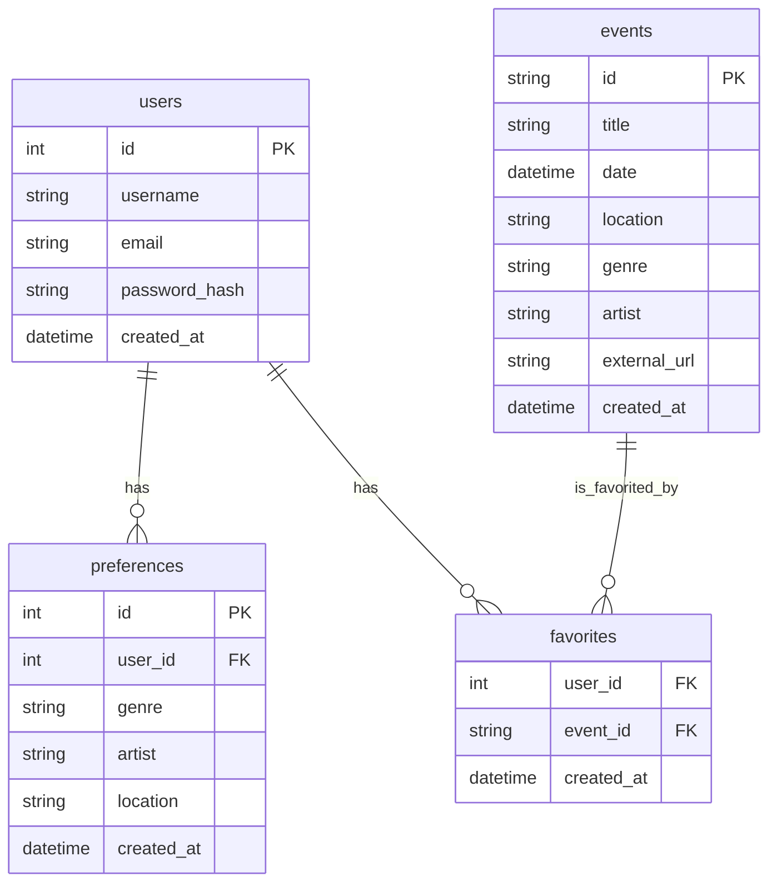
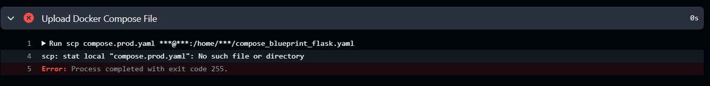

# Teil 3 Realisieren

- [Teil 3 Realisieren](#teil-3-realisieren)
- [Realisieren](#realisieren)
  - [Datenbank](#datenbank)
  - [Entwicklung](#entwicklung)
    - [Aufgetretene Probleme](#aufgetretene-probleme)
      - [Pipline](#pipline)
  - [Fallbacksolution](#fallbacksolution)
- [Kontrollieren](#kontrollieren)
  - [Testing](#testing)
    - [Testkonzept](#testkonzept)
    - [Testdurchführung](#testdurchführung)

# Realisieren

- Features, die umgesetzt wurden
- Herausforderungen & Lösungen
- REST-API Endpoints
- Docker-Setup
- Anbindung an externe API
- Datenbankdesign
- Filterfunktionen
- Codebeispiele (Auszüge)

## Datenbank

## Entwicklung

Image location: https://github.com/lauradubach?tab=packages

### Aufgetretene Probleme

#### Pipline

zuerst access error -> es musste noch ein PAT token erstellt werden

nun kam folgender error:

hier musste im  deploy job folgender Punkt ergänzt werden: `- uses: actions/checkout@v3`

## Fallbacksolution

# Kontrollieren

## Testing
### Testkonzept

| Testperson | Datum |
| ---------- | ----- |

| System | Testmittel | Testmethode |
| -------| ---------- | ----------- |

### Testdurchführung

| Testfall | Erwartetes Ergebnis | Testresultat |
| ---------| ------------------- | ------------ |

> Back [Page](https://github.com/lauradubach/Semesterarbeit3/blob/main/Sites/Teil%202%20Konzeption.md)
>
> Next [Page](https://github.com/lauradubach/Semesterarbeit3/blob/main/Sites/Teil%204%20Abschluss.md)