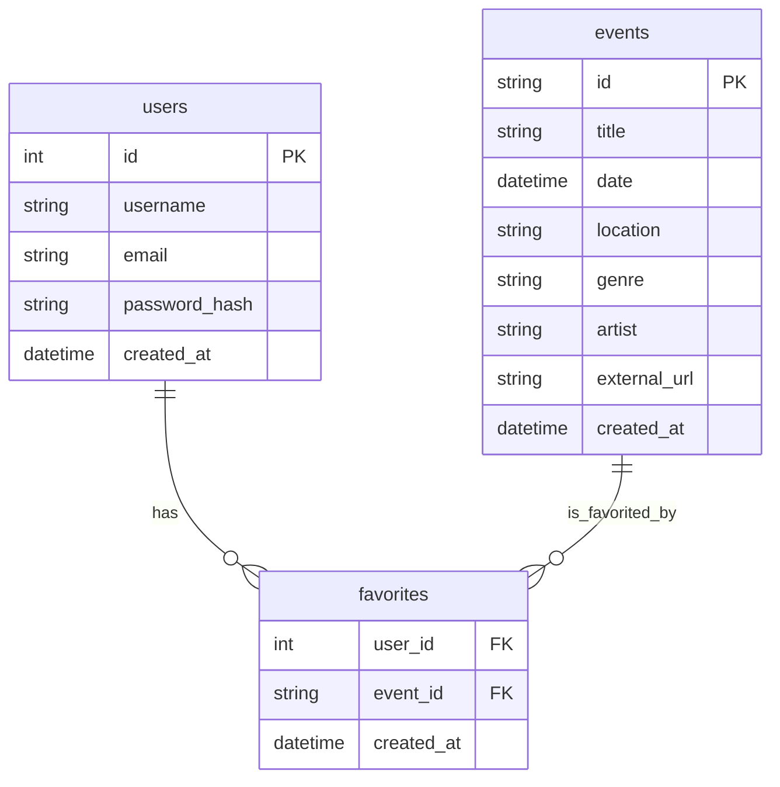
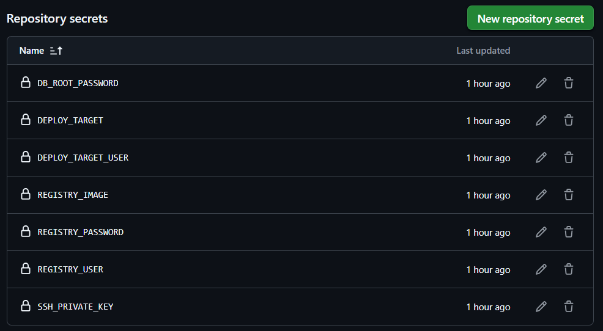

# Teil 3 Realisieren

- [Teil 3 Realisieren](#teil-3-realisieren)
- [Realisieren](#realisieren)
  - [Datenbank](#datenbank)
  - [Entwicklung](#entwicklung)
    - [Aufgetretene Probleme](#aufgetretene-probleme)
      - [Pipline](#pipline)
  - [Fallbacksolution](#fallbacksolution)
- [Kontrollieren](#kontrollieren)
  - [Testing](#testing)
    - [Testkonzept](#testkonzept)
    - [Testdurchführung](#testdurchführung)

# Realisieren

- Features, die umgesetzt wurden
- Herausforderungen & Lösungen
- REST-API Endpoints
- Docker-Setup
- Anbindung an externe API
- Datenbankdesign
- Filterfunktionen
- Codebeispiele (Auszüge)

## Datenbank

## Entwicklung

Meine lokale URL: http://localhost:5000/ui/search

Image location: https://github.com/lauradubach?tab=packages

Secrets:

Funktionierende Pipline:

### Aufgetretene Probleme

#### Pipline

zuerst access error -> es musste noch ein PAT token erstellt werden

nun kam folgender error:

hier musste im  deploy job folgender Punkt ergänzt werden: `- uses: actions/checkout@v3`

Favorites hinzufügen:

Im ui/routes.py (im login und register) musste session['user_id'] = data['user_id']
Im users/routes.py musste return {
        'token': token,
        'duration': 600,
        'user_id': user.id
    }
Im models/user.py musste user_id = Integer() Im TokenOut

hinzugefügt werden, da die User ID im json nicht übergeben wurde

damit wenn man den button anklickt die bestehnde suche bleibt habe ich im html dies hinzugefügt: <input type="hidden" name="next" value="{{ request.url }}">

auch im favorites/routes musste dies entsprechend ergänzt werden.

ich musste javascript und css integrieren, da sonst wenn man beim Klick auf einen Stern direkt was ändern möchte (Farbe, Favorit speichern), ohne die Seite zu laden, braucht man ein bisschen JavaScript, um: den Klick abzufangen, den Server anzufragen (mit fetch) und den Stern einfärben (CSS-Klasse setzen)

Tests:

Elastic Adresse: 54.156.170.152

Pfad um auf EC2 Maschine zu connecten: ssh -i "eventfinder-key.pem" ec2-user@ec2-54-156-170-152.compute-1.amazonaws.com

## Fallbacksolution

# Kontrollieren

## Testing
### Testkonzept

| Testperson | Datum |
| ---------- | ----- |

| System | Testmittel | Testmethode |
| -------| ---------- | ----------- |

### Testdurchführung

| Testfall | Erwartetes Ergebnis | Testresultat |
| ---------| ------------------- | ------------ |

> Back [Page](https://github.com/lauradubach/Semesterarbeit3/blob/main/Sites/Teil%202%20Konzeption.md)
>
> Next [Page](https://github.com/lauradubach/Semesterarbeit3/blob/main/Sites/Teil%204%20Abschluss.md)