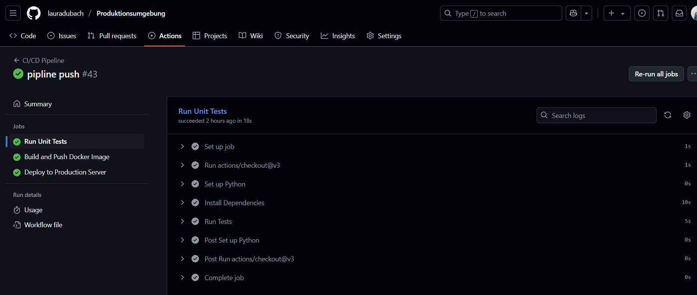

# Teil 3 Realisieren

Kommen wir zur Umsetzung des Projektes. In diesem Teil wird genau beschrieben, wie alles realisiert wurde und wie ich vorgegangen bin. Es wird getestet und geprüft, sodass ersichtlich ist, ob alles funktioniert wie es soll. Falls Probleme aufgetaucht sind, werden diese ebenfalls beschrieben, inklusive Lösungsweg.

- [Teil 3 Realisieren](#teil-3-realisieren)
- [Realisieren](#realisieren)
  - [Datenbank](#datenbank)
  - [Externe Ticketmaster API](#externe-ticketmaster-api)
  - [Github Secrets](#github-secrets)
  - [Entwicklung](#entwicklung)
    - [Features des Eventfinders](#features-des-eventfinders)
    - [REST-API Endpoints](#rest-api-endpoints)
    - [Docker-Setup](#docker-setup)
    - [Anbindung an externe API](#anbindung-an-externe-api)
    - [Filterfunktionen](#filterfunktionen)
    - [Bereitstellung über CI/CD-Pipeline (AWS EC2)](#bereitstellung-über-cicd-pipeline-aws-ec2)
    - [Codebeispiele](#codebeispiele)
    - [Aufgetretene Probleme](#aufgetretene-probleme)
  - [Fallbacksolution](#fallbacksolution)
- [Kontrollieren](#kontrollieren)
  - [Testing](#testing)
    - [Testkonzept](#testkonzept)
    - [Testdurchführung](#testdurchführung)
      - [Lokale Umgebung:](#lokale-umgebung)
      - [Produktive Umgebung:](#produktive-umgebung)

# Realisieren

Nun wird die Realisierung beschrieben. Die Umsetzung der Arbeit wird gezeigt inklusive Bilder der Produktiven Umgebung.

## Datenbank

Das Datenbankmodell besteht aus zwei Tabellen: users und favorites. Jeder Benutzer kann beliebig viele Events über ihre event_id als Favoriten speichern, wobei die Event-Daten über die externe Ticketmaster-API verwaltet und abgerufen werden.


## Externe Ticketmaster API

Die Ticketmaster API habe ich auf folgender Site bezogen: (https://developer-acct.ticketmaster.com/)

## Github Secrets

In diesem Projekt werden GitHub Secrets verwendet, um sensible Informationen sicher innerhalb der CI/CD-Pipeline bereitzustellen. Sie ermöglichen es, automatisierte Prozesse wie das Bauen und Deployen der Anwendung durchzuführen, ohne Zugangsdaten im Quellcode zu speichern.

Hier sind all meine Secrets:


## Entwicklung

Dies ist der Pfad um auf den Musik Event finder zu gelangen: http://54.156.170.152/ (Nur erreichbar wenn das AWS Learner LAB aktiv ist)

Wie folgt sehen die verchiedenen Seiten aus:

Login Seite:


Registrierungs Seite:


Such Seite:


Abfrage Beispiel Event:


Favoriten Seite:


### Features des Eventfinders

Im Microservice wurden zentrale Funktionen wie Benutzerregistrierung und Login mit sicherer Passwortspeicherung umgesetzt. Nutzer können gezielt nach Events suchen, diese als Favoriten markieren und erhalten zu jedem Event einen Direktlink zum Ticketkauf. Die Events selbst werden dynamisch über die Ticketmaster-API bezogen.

### REST-API Endpoints

Der Microservice bietet mehrere REST-Endpoints zur Interaktion mit Nutzern und Events. Es wurden u. a. Routen für Registrierung, Login, Event-Suche, Favoritenverwaltung und API-Datenbereitstellung implementiert. Die Schnittstellen sind klar strukturiert und REST-konform.

###  Docker-Setup

Für eine einfache Bereitstellung wurde ein Docker-Setup erstellt. Dieses umfasst das Flask-Backend sowie alle notwendigen Abhängigkeiten, sodass der Service containerisiert und unabhängig vom Host-System betrieben werden kann.

### Anbindung an externe API

Die Event-Daten stammen aus der offiziellen Ticketmaster-API. Die API wurde über HTTP-Requests angebunden, die Suchparameter dynamisch angepasst, und die Ergebnisse anschließend im Frontend verwendet.

### Filterfunktionen

Nutzer können Events anhand verschiedener Kriterien filtern. Implementiert wurden Filter für Genre, Stadt, Land sowie für ein frei wählbares Datumsintervall ("von–bis"). Dadurch wird eine gezielte und flexible Event-Suche ermöglicht.

### Bereitstellung über CI/CD-Pipeline (AWS EC2)

Der Microservice wird automatisiert über eine CI/CD-Pipeline auf einer AWS EC2-Instanz bereitgestellt. Nach jedem Push ins Repository erfolgt ein automatischer Build und Deployment-Prozess, sodass neue Änderungen ohne manuellen Eingriff live geschaltet werden können. Dies sorgt für eine kontinuierliche, zuverlässige Auslieferung der Anwendung.

### Codebeispiele

Der gesamte Code, sowie die vollständige Projektstruktur sind im öffentlich verlinkten Git-Repository verfügbar. Dadurch lässt sich der Aufbau des Microservices nachvollziehen und erweitern.

Mein ganzer Code: [Produktionsumgebung](https://github.com/lauradubach/Produktionsumgebung.git)

### Aufgetretene Probleme

Favorites hinzufügen:

Im ui/routes.py (im login und register) musste session['user_id'] = data['user_id']
Im users/routes.py musste return {
        'token': token,
        'duration': 600,
        'user_id': user.id
    }
Im models/user.py musste user_id = Integer() Im TokenOut

hinzugefügt werden, da die User ID im json nicht übergeben wurde

damit wenn man den button anklickt die bestehnde suche bleibt habe ich im html dies hinzugefügt: <input type="hidden" name="next" value="{{ request.url }}">

auch im favorites/routes musste dies entsprechend ergänzt werden.

ich musste javascript und css integrieren, da sonst wenn man beim Klick auf einen Stern direkt was ändern möchte (Farbe, Favorit speichern), ohne die Seite zu laden, braucht man ein bisschen JavaScript, um: den Klick abzufangen, den Server anzufragen (mit fetch) und den Stern einfärben (CSS-Klasse setzen)

Migration in die Produktivumgebung:

Die Seite konnte ich aufrufen, sobald ich mich aber eingeloggt habe kam einfach nichts mehr.

Das ganze Code snippet im ui/routes vom Login und Register musste abgeändert werden, hier als Beispiel der Login Code:

Alt:
```python
@bp.route('/login', methods=['GET', 'POST'])
def login():
    if request.method == 'POST':
        email = request.form['email']
        password = request.form['password']
 
        print("POST to", f'{API_BASE}/users/login')
        print("Request Payload:", {'email': email, 'password': password})
 
        response = requests.post(f'{API_BASE}/users/login', json={
            'email': email,
            'password': password
        })
        print("Registrierungsantwort:", response.text)
 
        if response.status_code == 200:
            data = response.json()
            session['auth_token'] = data['token']
            session['user_id'] = data['user_id']
            flash('Login successful', 'success')
            return redirect(url_for('ui.search'))
        else:
            flash('Invalid credentials', 'danger')
 
    return render_template('users/login.html')
```
Neu:

```python
@bp.route('/login', methods=['GET'])
def login_get():
    return render_template('users/login.html')


@bp.route('/login', methods=['POST'])
@bp.input(LoginIn, location='form')
def login_post(form_data=None):

    email = form_data['email']
    password = form_data['password']

    data = authenticate_user(email, password)
    if data:
        session['auth_token'] = data['token']
        session['user_id'] = data['user_id']
        flash('Login erfolgreich', 'success')
        return redirect(url_for('ui.search'))
    else:
        flash('Login fehlgeschlagen. Bitte E-Mail und Passwort kontrollieren.', 'danger')
        return redirect(url_for('ui.login_get'))
```

Die funktion Get und Post musste getrennt werden, auch hiermit konnte Flask nicht umgehen `response = requests.post`


## Fallbacksolution

Da das Projekt nicht für den Produktiven Gebrauch gedacht ist, da das ganze sich auf einem Learner LAB befindet, benötigt es keine Fallbacksolution. Falls etwas nicht klappt, kann das ganze einfach heruntergefahren werden und wieder auf der lokalen Umgebung bearbeitet werden.

# Kontrollieren
Die Kontrolle ist sehr wichtig. So kann versichert werden, dass das Enprodukt funktioniert und alle Tests erfolgreich geklappt haben. 

## Testing
### Testkonzept

| Testperson | Datum |
| ---------- | ----- |
| Laura Dubach | 26.06.2025 |

| System | Testmittel | Testmethode |
| -------| ---------- | ----------- |
| Microservice | Github, Python Skripts, EC2 AWS Instanz, Docker Desktop | Funktionaler Test |

In diesen Tests wird die Funktionalität des entwickelten Musik Event Finders getestet. Die produktive und die lokale Umgebung werden getestet. 

### Testdurchführung

| Testfall | Erwartetes Ergebnis | Testresultat |
| ---------| ------------------- | ------------ |
| Tests der ganzen Umgebung | Alle Tests laufen erfolgreich durch. | Die Tests laufen alle durch, die Umgebung nun Produktiv geschalten werden:  |
| Lokaler Test der Website | Website startet und alle Funktionen funktionieren | Die Website kann erfolgreich aufgerufen werden, Registrierung User klappt, Login User klappt, Event Suche klappt, Eventfavoritisieren klappt. |
| Pipline Testen | Pipline läuft erfolgreich durch | Alles läuft durch und die Pipline pushed erfolgreich auf die EC2 Instanz:  |
| SSH auf EC2 Instanz | SSH connection auf EC2 Instanz testen | Im Ordner .ssh mit dem Befehl 'ssh -i "eventfinder-key.pem" ec2-user@ec2-54-156-170-152.compute-1.amazonaws.com' gelingt der Zugriff:  | 
| Produktive Website Testen | Website startet und alle Funktionen funktionieren | Die Website kann über die erstellte Elastic IP aufgerufen werden  (http://54.156.170.152/) und alle Funktionen funktionieren. |


#### Lokale Umgebung:

#### Produktive Umgebung:


> Back [Page](https://lauradubach.github.io/Semesterarbeit3/Sites/Teil%202%20Konzeption.html)
>
> Next [Page](https://lauradubach.github.io/Semesterarbeit3/Sites/Teil%204%20Abschluss.html)