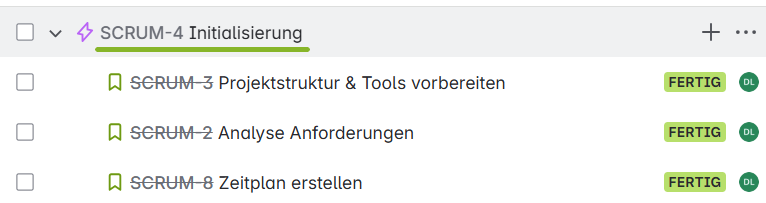
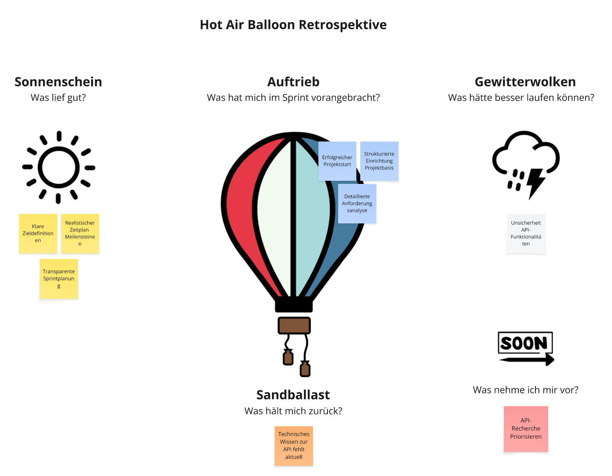
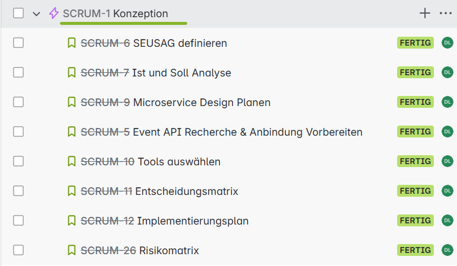
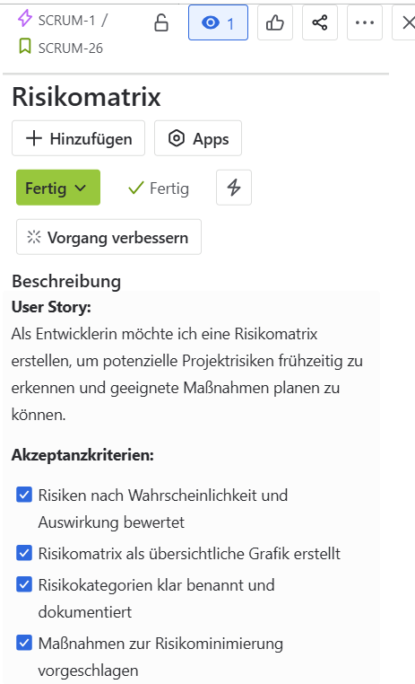
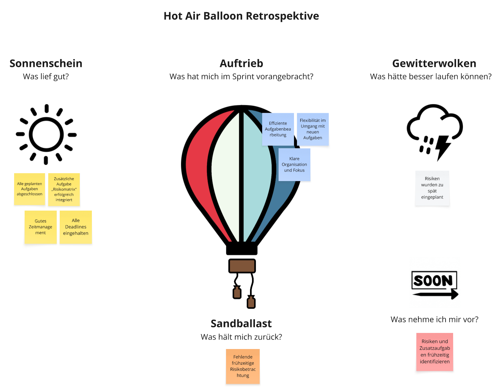
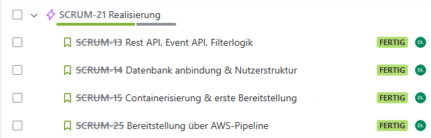
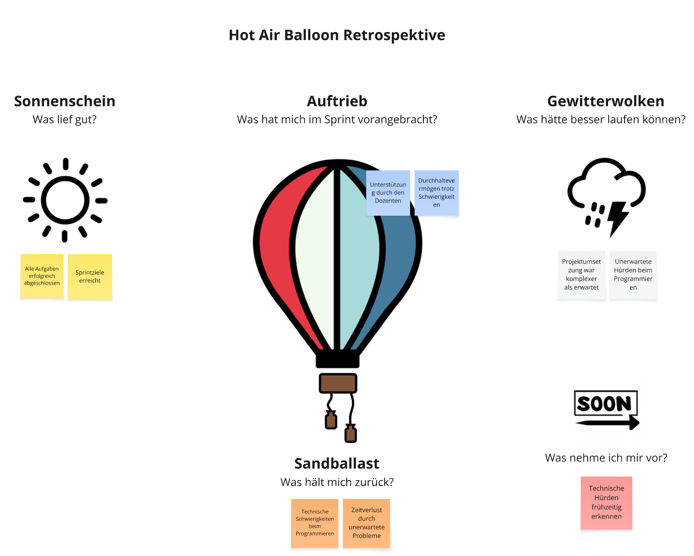

# Sprint Abschlüsse

- [Sprint Abschlüsse](#sprint-abschlüsse)
  - [Sprint Review 1](#sprint-review-1)
    - [Abgeschlossene Story\`s](#abgeschlossene-storys)
    - [Besprechung](#besprechung)
  - [Sprint-Retrospektive 1](#sprint-retrospektive-1)
  - [Sprint Review 2](#sprint-review-2)
    - [Abgeschlossene Story\`s](#abgeschlossene-storys-1)
    - [Besprechung](#besprechung-1)
  - [Sprint-Retrospektive 2](#sprint-retrospektive-2)
  - [Sprint Review 3](#sprint-review-3)
    - [Abgeschlossene Story\`s](#abgeschlossene-storys-2)
  - [Sprint-Retrospektive 3](#sprint-retrospektive-3)
  - [Sprint Review 4](#sprint-review-4)
    - [Abgeschlossene Story\`s](#abgeschlossene-storys-3)
    - [Besprechung](#besprechung-2)
  - [Sprint-Retrospektive 4](#sprint-retrospektive-4)
      - [Was lief gut](#was-lief-gut)
      - [Was hätte besser laufen können](#was-hätte-besser-laufen-können)
      - [Was nehmen ich mir vor](#was-nehmen-ich-mir-vor)

## Sprint Review 1

### Abgeschlossene Story`s

Alle vorgesehenen Story`s konnten fristgerecht abgeschlossen werden.

Folgendes wurde genau umgesetzt:

- Git-Repository ist eingerichtet.
- Ordnerstruktur erstellt.
- Tools vorbereitet.
- Anforderungen sind dokumentiert.
- Es gibt eine klare Unterscheidung zwischen Muss-, Soll- und Kann-Anforderungen.
- Wichtige Informationen sind dokumentiert.
- Alle Meilensteine sind enthalten.
- Abhängigkeiten sind berücksichtigt.
- Der Zeitplan ist mit den Sprints abgestimmt.

### Besprechung

| Besprechung | Datum | Uhrzeit | Teilnehmer | 
| ---- | ---- | ---- | ---- |
| 1 | 09.05.2025| 19:30 | Corrado Parisi, Laura Dubach |

Corrado und ich haben uns über eine Teamviewer session getroffen.

Folgende Fragen habe ich vorbereitet.

1. Reicht es in den Acceptance Criteria nur den Punkt zu definieren oder wird ein ganzer Satz benötigt? 
2. Wo soll das Sprintplanning im dokument am besten hinterlegt werden? 
3. Darf ich die Struktur so belassen? Für mich ist es einfacher so zu arbeiten, als alles in einem Dokument zu haben.
4. Darf ich ChatGPT verwenden um texte zu schreiben usw, mit Quellenangabe natürlich?

Er meinte das ich schon gut vorbereitet set. So wie ich die User Story`s und Acceptance Criteria geschrieben habe passt es. Für das Sprintplanning kann ich am besten einen Ordner in meinem Repo anlegen, damlich ist und man es direkt findet. Die Struktur ist gut, bei der Abgabe soll jedoch ein ganzes Dokument abgegeben werden oder mit Github Pages das ganze gelöst werden. ChatGPT darf ich verwenden solange ich die Quellen hinterlegt habe. So wie ich dies bis jetzt schon umgesetzt habe.

Er hatte noch ein paar Ideen die ich umsetzten kann:

1. Risikomatrix
2. Eine kurze reflexion im sprint review (wie ist es gelaufen, was könnte besser laufe)

Das Gespräch verlauf super. All meine Fragen konnten beantwortet werden und Corrado konnte mir gute Tipps geben. Nun kann ich weiterarbeiten.

## Sprint-Retrospektive 1

## Sprint Review 2

### Abgeschlossene Story`s

Alle vorgesehenen Story`s konnten fristgerecht abgeschlossen werden.

Folgendes wurde genau umgesetzt:

- Systemgrenzen sind Dokumentiert.
- SEUSAG Grafik ist vorhanden.
- Ist-Zustand dokumentiert.
- Soll-Zustand definiert.
- Grafik erstellt.
- Anzahl und Aufgaben der Microservices definiert.
- Vergleich von mindestens zwei API-Lösungen dokumentiert.
- Vor- und Nachteile analysiert.
- Entscheidung für API getroffen.
- Schnittstelle vorbereitet.
- Liste mit evaluierten Tools liegt vor.
- Entscheidungskriterien sind dokumentiert.
- Ausgewählte Tools sind einsatzbereit.
- Kriterien sind transparent und gewichtet.
- Technologien wurden objektiv verglichen.
- Die Entscheidung ist begründet dokumentiert.
- Aufgabenpakete logisch gegliedert.
- Grafik erstellt.

Folgender Punkt wurde während dem Sprint ergänzt:

### Besprechung

| Besprechung | Datum | Uhrzeit | Teilnehmer | 
| ---- | ---- | ---- | ---- |
| 2 | 02.06.2025 | 18:45 | Corrado Parisi, Laura Dubach |

Corrado und ich haben uns über eine Teamviewer session getroffen.

Folgende Fragen habe ich vorbereitet.

1. Darf ich meine Epics als Meilensteine definieren?
2. Die Verlinkung der Sites sind momentan auf Github umgeleitet und nicht auf Github Pages, sollte ich sie auf Github Pages umleiten, dass alles nur dort verlinkt ist?
3. Sind 2 Repos okey? Eines für die Umsetzung und eines für die Dokumentation?

Er meinte es sei eine gute Idee die Epics als Meilensteine zu definieren. Ich sollte Sie jedoch noch nummerieren, damit es Übersichtlicher ist. Er wird Github selbst nicht wirklich anschauen sondern hauptsächlich auf Github Pages die Arbeit bewerten, deshalb ist es Sinnvoll, dass die Verlinkung dort funktioniert. Bezüglich den 2 Repos meinte er, dass dies auch gut so ist, da er ja hauptsächlich die Dokumentation anschauen und Boris den Praktischen teil. So ist dies auch gleich gut unterteilt. Im Teams Channel ist dies auch so abgelegt.

Er hatte noch eine paar Ideen die ich umsetzten kann:

1. Bei der Sprintretrospektive eine Grafik zur Darstellung um den Text zu minimieren
2. Bei den Meilensteinen eine nummerierung machen

Das Gespräch verlauf super. All meine Fragen konnten beantwortet werden und Corrado konnte mir gute Tipps geben. Nun kann ich weiterarbeiten.

## Sprint-Retrospektive 2

## Sprint Review 3

### Abgeschlossene Story`s

Alle vorgesehenen Story`s konnten fristgerecht abgeschlossen werden.

Folgendes wurde genau umgesetzt:

- API-Endpunkte funktionieren wie spezifiziert.
- Events werden korrekt ausgelöst und verarbeitet.
- Filterlogik liefert konsistente Ergebnisse.
- Datenbankverbindung besteht stabil.
- CRUD-Funktionalität ist gegeben.
- Dockerfile vorhanden und funktionsfähig.
- Anwendung läuft lokal und/oder auf Testumgebung.
- Readme beschreibt Startvorgang.
- CI/CD-Pipeline ist eingerichtet.
- Deployment auf AWS erfolgt automatisch bei Push auf Main.
- Zugang zur Anwendung ist dokumentiert.

## Sprint-Retrospektive 3

## Sprint Review 4

### Abgeschlossene Story`s

Folgendes wurde genau umgesetzt:

### Besprechung

| Besprechung | Datum | Uhrzeit | Teilnehmer | 
| ---- | ---- | ---- | ---- |
| 4 | 07.07.2025 | | Corrado Parisi, Laura Dubach |

## Sprint-Retrospektive 4

#### Was lief gut

#### Was hätte besser laufen können

#### Was nehmen ich mir vor
