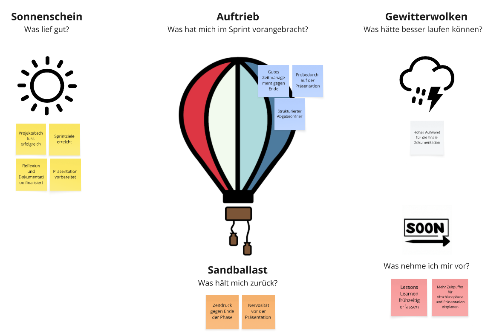

# Sprint Abschlüsse

- [Sprint Abschlüsse](#sprint-abschlüsse)
  - [Sprint Review 1](#sprint-review-1)
    - [Abgeschlossene Story\`s](#abgeschlossene-storys)
    - [Besprechung](#besprechung)
  - [Sprint-Retrospektive 1](#sprint-retrospektive-1)
    - [Sonnenschein](#sonnenschein)
    - [Auftrieb](#auftrieb)
    - [Gewitterwolken](#gewitterwolken)
    - [Sandbalast](#sandbalast)
    - [Ausblick](#ausblick)
  - [Sprint Review 2](#sprint-review-2)
    - [Abgeschlossene Story\`s](#abgeschlossene-storys-1)
    - [Besprechung](#besprechung-1)
  - [Sprint-Retrospektive 2](#sprint-retrospektive-2)
    - [Sonnenschein](#sonnenschein-1)
    - [Auftrieb](#auftrieb-1)
    - [Gewitterwolken](#gewitterwolken-1)
    - [Sandballast](#sandballast)
    - [Ausblick](#ausblick-1)
  - [Sprint Review 3](#sprint-review-3)
    - [Abgeschlossene Story\`s](#abgeschlossene-storys-2)
  - [Sprint-Retrospektive 3](#sprint-retrospektive-3)
    - [Sonnenschein](#sonnenschein-2)
    - [Auftrieb](#auftrieb-2)
    - [Gewitterwolken](#gewitterwolken-2)
    - [Sandballast](#sandballast-1)
    - [Ausblick](#ausblick-2)
  - [Sprint Review 4](#sprint-review-4)
    - [Abgeschlossene Story\`s](#abgeschlossene-storys-3)
  - [Sprint-Retrospektive 4](#sprint-retrospektive-4)
    - [Sonnenschein](#sonnenschein-3)
    - [Auftrieb](#auftrieb-3)
    - [Gewitterwolken](#gewitterwolken-3)
    - [Sandballast](#sandballast-2)
    - [Ausblick](#ausblick-3)

## Sprint Review 1

### Abgeschlossene Story`s

Alle vorgesehenen Story`s konnten fristgerecht abgeschlossen werden.

Folgendes wurde genau umgesetzt:

- Git-Repository ist eingerichtet.
- Ordnerstruktur erstellt.
- Tools vorbereitet.
- Anforderungen sind dokumentiert.
- Es gibt eine klare Unterscheidung zwischen Muss-, Soll- und Kann-Anforderungen.
- Wichtige Informationen sind dokumentiert.
- Alle Meilensteine sind enthalten.
- Abhängigkeiten sind berücksichtigt.
- Der Zeitplan ist mit den Sprints abgestimmt.

### Besprechung

| Besprechung | Datum | Uhrzeit | Teilnehmer | 
| ---- | ---- | ---- | ---- |
| 1 | 09.05.2025| 19:30 | Corrado Parisi, Laura Dubach |

Corrado und ich haben uns über eine Teamviewer session getroffen.

Folgende Fragen habe ich vorbereitet.

1. Reicht es in den Acceptance Criteria nur den Punkt zu definieren oder wird ein ganzer Satz benötigt? 
2. Wo soll das Sprintplanning im dokument am besten hinterlegt werden? 
3. Darf ich die Struktur so belassen? Für mich ist es einfacher so zu arbeiten, als alles in einem Dokument zu haben.
4. Darf ich ChatGPT verwenden um texte zu schreiben usw, mit Quellenangabe natürlich?

Er meinte, dass ich schon gut vorbereitet sei. So wie ich die User Story`s und Acceptance Criteria geschrieben habe, passt es. Für das Sprintplanning könnte ich am besten einen Ordner in meinem Repository anlegen, damit es übersichtlich ist und man es direkt findet. Die Struktur ist gut, bei der Abgabe soll jedoch ein ganzes Dokument abgegeben werden oder mit Github Pages das ganze gelöst werden. ChatGPT darf ich verwenden solange ich die Quellen hinterlegt habe. So wie ich dies bis jetzt schon umgesetzt habe.

Er hatte noch ein paar Ideen, die ich umsetzten könnte:

1. Risikomatrix
2. Eine kurze reflexion im sprint review (wie ist es gelaufen, was könnte besser laufen)

Das Gespräch verlauf super. All meine Fragen konnten beantwortet werden und Corrado konnte mir gute Tipps geben. Nun kann ich weiterarbeiten.

## Sprint-Retrospektive 1

### Sonnenschein

- Klare Zieldefinitionen
- Realistischer Zeitplan mit Meilensteinen
- Transparente Sprintplanung

### Auftrieb

- Erfolgreicher Projektstart
- Strukturierte Einrichtung Projektbasis
- Detaillierte Anforderungsanalyse

### Gewitterwolken

- Unsicherheit API-Funktionalitäten

### Sandbalast

- Technisches Wissen zur API fehlt aktuell

### Ausblick

- API-Recherche priorisieren

## Sprint Review 2

### Abgeschlossene Story`s

Alle vorgesehenen Story`s konnten fristgerecht abgeschlossen werden.

Folgendes wurde genau umgesetzt:

- Systemgrenzen sind Dokumentiert.
- SEUSAG Grafik ist vorhanden.
- Ist-Zustand dokumentiert.
- Soll-Zustand definiert.
- Grafik erstellt.
- Anzahl und Aufgaben der Microservices definiert.
- Vergleich von mindestens zwei API-Lösungen dokumentiert.
- Vor- und Nachteile analysiert.
- Entscheidung für API getroffen.
- Schnittstelle vorbereitet.
- Liste mit evaluierten Tools liegt vor.
- Entscheidungskriterien sind dokumentiert.
- Ausgewählte Tools sind einsatzbereit.
- Kriterien sind transparent und gewichtet.
- Technologien wurden objektiv verglichen.
- Die Entscheidung ist begründet dokumentiert.
- Aufgabenpakete logisch gegliedert.
- Grafik erstellt.

Folgender Punkt wurde während dem Sprint ergänzt:

### Besprechung

| Besprechung | Datum | Uhrzeit | Teilnehmer | 
| ---- | ---- | ---- | ---- |
| 2 | 02.06.2025 | 18:45 | Corrado Parisi, Laura Dubach |

Corrado und ich haben uns über eine Teamviewer session getroffen.

Folgende Fragen habe ich vorbereitet.

1. Darf ich meine Epics als Meilensteine definieren?
2. Die Verlinkung der Sites sind momentan auf Github umgeleitet und nicht auf Github Pages, sollte ich sie auf Github Pages umleiten, damit alles nur dort verlinkt ist?
3. Sind 2 Repos okey? Eines für die Umsetzung und eines für die Dokumentation?

Er meinte es sei eine gute Idee, die Epics als Meilensteine zu definieren. Ich sollte sie jedoch noch nummerieren, damit es Übersichtlicher ist. Er wird Github selbst nicht anschauen, sondern hauptsächlich auf Github Pages die Arbeit bewerten. Deshalb ist es sinnvoll, dass die Verlinkung auf Github Pages funktioniert. Bezüglich den 2 Repositorys meinte er, dass diese auch gut sind, da er hauptsächlich die Dokumentation anschaut und Boris den praktischen Teil bewertet. So ist es übesichtlich und gut unterteilt. Im Teams Channel ist dies auch so abgelegt.

Er hatte noch eine paar Ideen, die ich umsetzten könne§:

1. Bei der Sprintretrospektive eine Grafik zur Darstellung um den Text zu minimieren
2. Bei den Meilensteinen eine nummerierung machen

Das Gespräch verlief super. All meine Fragen konnten beantwortet werden und Corrado gab mir gute Tipps. Nun kann ich weiterarbeiten.

## Sprint-Retrospektive 2

### Sonnenschein

- Alle geplanten Aufgaben abgeschlossen
- Zusätzliche Aufgabe („Risikomatrix“) erfolgreich integriert
- Gutes Zeitmanagement
- Alle Deadlines eingehalten

### Auftrieb

- Effiziente Aufgabenbearbeitung
- Flexibilität im Umgang mit neuen Aufgaben
- Klare Organisation und Fokus

### Gewitterwolken

- Risiken wurden zu spät eingeplant

### Sandballast

- Fehlende frühzeitige Risikobetrachtung

### Ausblick

- Risiken und Zusatzaufgaben frühzeitig identifizieren und einplanen

## Sprint Review 3

### Abgeschlossene Story`s

Alle vorgesehenen Story`s konnten fristgerecht abgeschlossen werden.

Folgendes wurde genau umgesetzt:

- API-Endpunkte funktionieren wie spezifiziert.
- Events werden korrekt ausgelöst und verarbeitet.
- Filterlogik liefert konsistente Ergebnisse.
- Datenbankverbindung besteht stabil.
- CRUD-Funktionalität ist gegeben.
- Dockerfile vorhanden und funktionsfähig.
- Anwendung läuft lokal und/oder auf Testumgebung.
- Readme beschreibt Startvorgang.
- CI/CD-Pipeline ist eingerichtet.
- Deployment auf AWS erfolgt automatisch bei Push auf Main.
- Zugang zur Anwendung ist dokumentiert.

## Sprint-Retrospektive 3

### Sonnenschein

- Alle Aufgaben erfolgreich abgeschlossen
- Sprintziele erreicht

### Auftrieb

- Unterstützung durch den Dozenten
- Durchhaltevermögen trotz Schwierigkeiten

### Gewitterwolken

- Projektumsetzung war komplexer als erwartet
- Unerwartete Hürden beim Programmieren

### Sandballast

- Technische Schwierigkeiten beim Programmieren
- Zeitverlust durch unerwartete Probleme

### Ausblick

- Technische Hürden frühzeitig erkennen

## Sprint Review 4

### Abgeschlossene Story`s

Alle vorgesehenen Story`s konnten fristgerecht abgeschlossen werden.

Folgendes wurde genau umgesetzt:

- Positive und negative Erfahrungen gesammelt.
- Reflexion ist ehrlich und konstruktiv.
- Ergebnisse dokumentiert.
- Inhalte aller Phasen dokumentiert.
- Lessons Learned aufgeführt.
- Dokument liegt final vor.
- Alle Dokumente sind vollständig.
- Abgabeordner strukturiert.
- Präsentation ist vollständig.
- Mindestens ein Probedurchlauf erfolgt.
- Zeitrahmen wird eingehalten.
- Abgabe erfolgt spätestens am 09.07.
- Bestätigung der Einreichung vorhanden.
- Alles ist final und unverändert.

## Sprint-Retrospektive 4

### Sonnenschein

- Projektabschluss erfolgreich
- Sprintziele erreicht
- Reflexion und Dokumentation finalisiert
- Präsentation vorbereitet

### Auftrieb

- Gutes Zeitmanagement gegen Ende
- Strukturierter Abgabeordner
- Probedurchlauf der Präsentation

### Gewitterwolken

- Hoher Aufwand für die finale Dokumentation

### Sandballast

- Zeitdruck gegen Ende der Phase
- Nervosität vor der Präsentation 

### Ausblick

- Lessons Learned frühzeitig erfassen
- Mehr Zeitpuffer für Abschlussphase und Präsentation einplanen