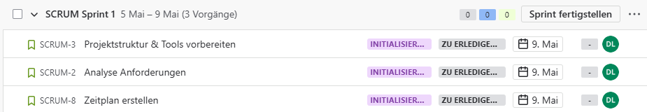
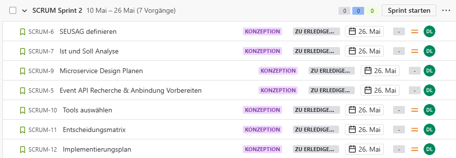
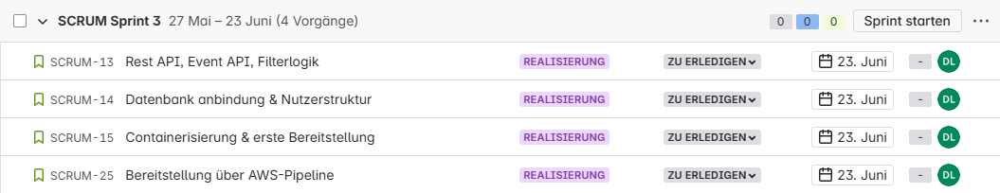
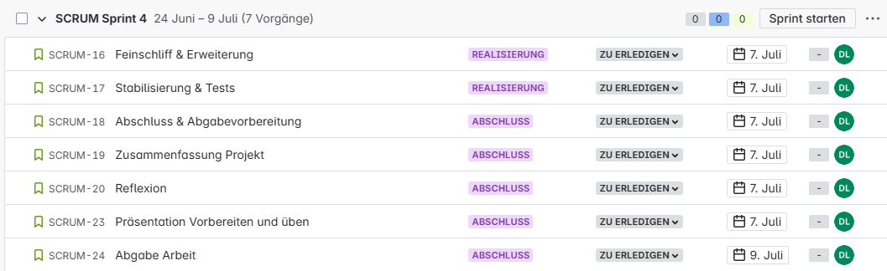

- [Sprint Planning](#sprint-planning)
  - [Sprint 1, 05.05 – 09.05 (5 Tage)](#sprint-1-0505--0905-5-tage)
    - [Aufgaben](#aufgaben)
    - [Aufgabenverteilung](#aufgabenverteilung)
    - [Nächste Schritte](#nächste-schritte)
  - [Sprint 2 10.05 – 26.05 (16 Tage)](#sprint-2-1005--2605-16-tage)
    - [Aufgabenverteilung](#aufgabenverteilung-1)
    - [Nächste Schritte](#nächste-schritte-1)
  - [Sprint 3: 27.05 – 23.06 (28 Tage)](#sprint-3-2705--2306-28-tage)
    - [Aufgabenverteilung](#aufgabenverteilung-2)
    - [Nächste Schritte](#nächste-schritte-2)
  - [Sprint 4: 24.06 – 09.07 (16 Tage)](#sprint-4-2406--0907-16-tage)
    - [Aufgabenverteilung](#aufgabenverteilung-3)
    - [Nächste Schritte](#nächste-schritte-3)

# Sprint Planning

Entwicklung eines Microservices für Event-Empfehlungen

**Zeitraum:** 05.05.2025 – 09.07.2025  
**Methode:** SCRUM  
**Anzahl Sprints:** 4 (Sprint 1 verkürzt)

## Sprint 1, 05.05 – 09.05 (5 Tage)

> Ziel: Das Projekt offiziell starten, die organisatorische Basis schaffen und erste technische Recherchen zur Event-API durchführen.

### Aufgaben

### Aufgabenverteilung

Alle Aufgaben werden von Laura Dubach umgesetzt.

### Nächste Schritte

- Sprintreview findet am: 09.05.2025 statt

## Sprint 2 10.05 – 26.05 (16 Tage)

> Ziel: Fachliches und technisches Konzept erstellen, Architekturentscheidungen treffen und Planung abschließen.

### Aufgabenverteilung

Alle Aufgaben werden von Laura Dubach umgesetzt.

### Nächste Schritte

- Sprintreview findet am: 02.06 statt

## Sprint 3: 27.05 – 23.06 (28 Tage)

> Ziel: Kernfunktionalität umsetzen: APIs, Datenbank, Containerisierung, sowie erste automatisierte Bereitstellung über AWS.

### Aufgabenverteilung

Alle Aufgaben werden von Laura Dubach umgesetzt.

### Nächste Schritte

- Sprintreview findet am: 20.06 statt

## Sprint 4: 24.06 – 09.07 (16 Tage)

> Ziel: Feinschliff, Absicherung durch Tests, Dokumentation und finale Abgabe.

### Aufgabenverteilung

Alle Aufgaben werden von Laura Dubach umgesetzt.

### Nächste Schritte

- Sprintreview findet am: 07.07 statt
