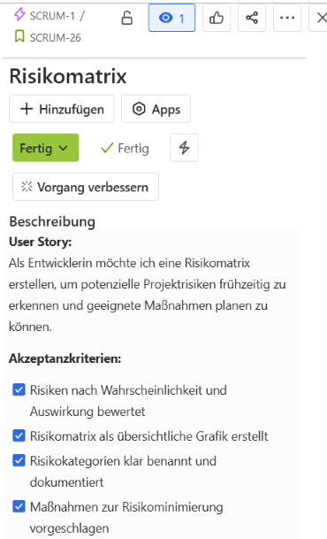

# Sprint Reviews

## Sprint Review 1

### Sprint-Retrospektive

#### Was lief gut

Starker Projektstart: Das Projekt wurde erfolgreich gestartet, inklusive klarer Zieldefinitionen.

Tooling & Struktur: Die Projektstruktur wurde konsistent aufgebaut, das Git-Repository eingerichtet und alle nötigen Tools vorbereitet – dadurch ist eine solide Arbeitsbasis geschaffen worden.

Anforderungsanalyse: Die Anforderungen wurden detailliert analysiert und dokumentiert.

Zeitplanung: Ein realistischer Zeitplan mit klaren Meilensteinen und Abhängigkeiten wurde erstellt. Die Abstimmung mit den Sprintphasen sorgt für Transparenz und Planungssicherheit.

#### Was hätte besser laufen können

Technische Recherchen zur Event-API: Dieser Aspekt des Sprint-Ziels wurde noch nicht bzw. nur am Rande adressiert. Hier besteht Nachholbedarf in Sprint 2.

#### Was nehmen ich mir vor

Technische Recherchen priorisieren: Die Recherche zur Event-API soll in Sprint 2 gezielt dokumentiert werden.

Tooling: Im nächsten Sprint werden die Tools verglichen und Entscheidungen getroffen.

### Besprechung

| Besprechung | Datum | Uhrzeit | Teilnehmer | 
| ---- | ---- | ---- | ---- |
| 1 | 09.05.2025| 19:30 | Corrado Parisi, Laura Dubach |

Corrado und ich haben uns über eine Teamviewer session getroffen.

Folgende Fragen habe ich vorbereitet.

1. Reicht es in den Acceptance Criteria nur den Punkt zu definieren oder wird ein ganzer Satz benötigt? 
2. Wo soll das Sprintplanning im dokument am besten hinterlegt werden? 
3. Darf ich die Struktur so belassen? Für mich ist es einfacher so zu arbeiten, als alles in einem Dokument zu haben.
4. Darf ich ChatGPT verwenden um texte zu schreiben usw, mit Quellenangabe natürlich?

Er meinte das ich schon gut vorbereitet set. So wie ich die User Story`s und Acceptance Criteria geschrieben habe passt es. Für das Sprintplanning kann ich am besten einen Ordner in meinem Repo anlegen, damlich ist und man es direkt findet. Die Struktur ist gut, bei der Abgabe soll jedoch ein ganzes Dokument abgegeben werden oder mit Github Pages das ganze gelöst werden. ChatGPT darf ich verwenden solange ich die Quellen hinterlegt habe. So wie ich dies bis jetzt schon umgesetzt habe.

Er hatte noch ein paar Ideen die ich umsetzten kann:

1. Risikomatrix
2. Eine kurze reflexion im sprint review (wie ist es gelaufen, was könnte besser laufe)

Das Gespräch verlauf super. All meine Fragen konnten beantwortet werden und Corrado konnte mir gute Tipps geben. Nun kann ich weiterarbeiten.

## Sprint Review 2

### Sprint-Retrospektive

#### Was lief gut

Alle geplanten Aufgaben wurden abgeschlossen. Zusätzliche Aufgabe „Risikomatrix“ wurde während des Sprints aufgenommen und ebenfalls erfolgreich abgeschlossen.

Zeitmanagement war sehr gut, alle Deadlines wurden eingehalten.

#### Was hätte besser laufen können

Die Einplanung von Risiken und Pufferzeit: Die Risikomatrix wurde zwar erfolgreich integriert, zeigt aber, dass potenzielle Risiken früher identifiziert und geplant werden sollten.

#### Was nehmen ich mir vor

Frühzeitige Identifikation und Planung potenzieller Zusatzaufgaben, damit diese nicht spontan eingeschoben werden müssen.

### Besprechung

| Besprechung | Datum | Uhrzeit | Teilnehmer | 
| ---- | ---- | ---- | ---- |
| 2 | 02.06.2025 | 18:45 | Corrado Parisi, Laura Dubach |

## Sprint Review 3

### Sprint-Retrospektive

#### Was lief gut

#### Was hätte besser laufen können

#### Was nehmen ich mir vor

### Besprechung

| Besprechung | Datum | Uhrzeit | Teilnehmer | 
| ---- | ---- | ---- | ---- |
| 3 | 20.06.2025 | 18:00 | Corrado Parisi, Laura Dubach |

## Sprint Review 4

### Sprint-Retrospektive

#### Was lief gut

#### Was hätte besser laufen können

#### Was nehmen ich mir vor

### Besprechung

| Besprechung | Datum | Uhrzeit | Teilnehmer | 
| ---- | ---- | ---- | ---- |
| 4 | 07.07.2025 | | Corrado Parisi, Laura Dubach |
